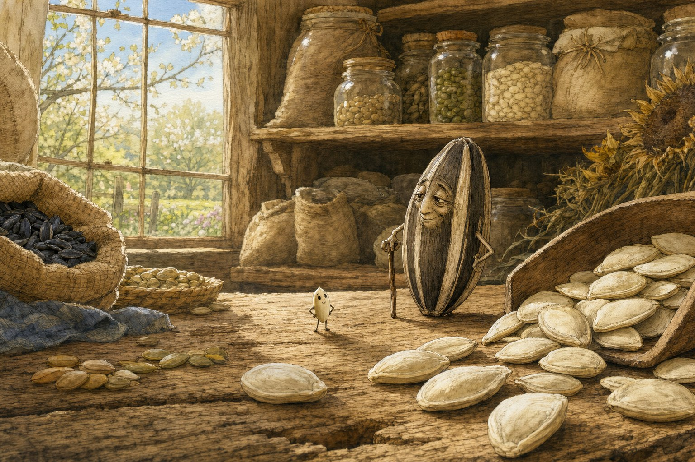
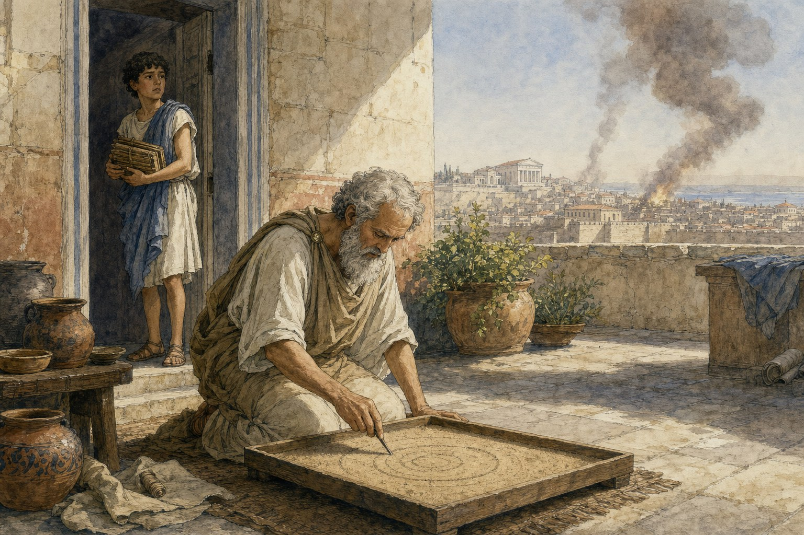

A few days ago [Karina Nguyen](https://x.com/karinanguyen) posted [her Lux Summit talk](https://x.com/karinanguyen/status/2073248122307002413) on storytelling and AI. Her claim: the loop that makes coding agents work (plan, write, test, debug) works for stories too, if you can build a real test phase. And storytelling already has a famous test phase. Pixar's [Braintrust](https://pixar.fandom.com/wiki/Brain_Trust) is a room of directors and writers who tear into every film while it's still storyboards. They say what's broken. The film's director decides how to fix it.

That maps almost one-to-one onto agent skills and subagents. So I built [storygen-skill](https://github.com/kashyab12/storygen-skill) for Cursor, Claude Code, and Codex, and had it write two illustrated books. Here they are.

## The stories it wrote

I asked for two samples. [Pip of Bramblewick Farm](https://github.com/kashyab12/storygen-skill/blob/main/samples/sesame-seed/storybook.pdf), a bedtime story about the smallest seed on the farm, who wants to be planted in the Big Field with the big seeds and gets swept out the shed door instead.

And [The Circles of Syracuse](https://github.com/kashyab12/storygen-skill/blob/main/samples/archimedes/storybook.pdf), which tells Archimedes' life in rings, drawn in a sand tray on the morning the Romans breach the city.

The revision logs are more fun than the stories. The tension reviewer killed the seed story's first plot before a word of prose existed: Pip ended up safely planted no matter what happened, so the big climactic sacrifice cost nothing. The plan got rebuilt until failure was real. The voice reviewer noticed two characters shared a counting tic and split them, one measures hopefully, the other counts fearfully. And on Archimedes, the worldbuilding reviewer fact-checked the draft against [The Sand Reckoner](https://en.wikipedia.org/wiki/The_Sand_Reckoner), the actual 2,200-year-old paper, and caught it lowballing Archimedes' estimate of 10⁶³ grains of sand to fill the universe. An editor, a script doctor, and a fact-checker, and all of them are the same model wearing different hats. That's the caveat too: this is structured self-review, not independent judgment. The stories still came out measurably better for it, and every change is logged with its reason.

## Where this goes

The pipeline didn't make the illustrations. I generated those with Codex and stitched the PDFs together after. The next version should be one loop: plan, draft, review, illustrate, ship the book, with a human as the director.

Past that, the story bible is a state machine, which opens formats print can't do. Choose-your-own-path stories where every branch stays continuity-checked. A bedtime serial that remembers what the dragon promised in episode twelve. A teaching story about the exact thing that happened at recess today. And every run logs its drafts, notes, and reasons, which is precisely the process data Karina says the field is missing.

The skill is a few days old and rough. Reviewer personas could be sharper, convergence is crude, and nothing checks an illustration against its scene. [Star the repo or open a PR](https://github.com/kashyab12/storygen-skill).

## Credit

The ideas are [Karina Nguyen](https://x.com/karinanguyen)'s: the coding-agent parallel, the spine, the story bible, the Braintrust framing, and the argument that teaching AI to tell great stories might be one of the more aligned ways to teach it to understand people. Her [thread](https://x.com/karinanguyen/status/2073248122307002413) and [slides](https://docs.google.com/presentation/d/1d7fsWsVYnKy0zVZhYil-cJ7ONEpnKB9D4sVmWGrAnJI/edit) are worth your time. The skill packaging, and any mistakes in translation, are mine. Code and samples are [on GitHub](https://github.com/kashyab12/storygen-skill), MIT licensed.
